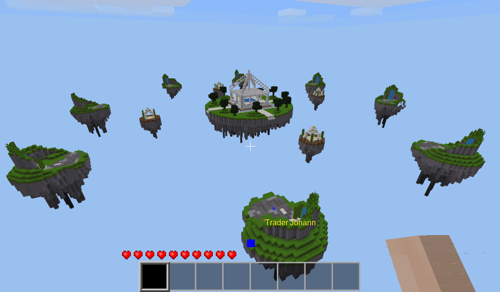
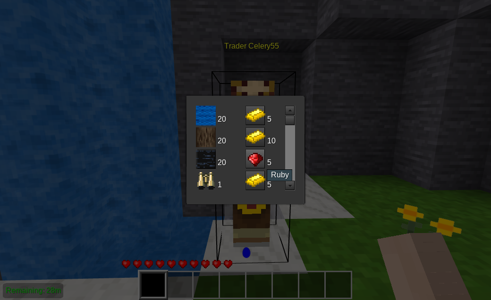

# Eggwars

## What this is

This mod is inspired by the Minecraft mod of the same name and has similar features.

Each player's goal is to defend their egg and be the last person standing. If a player dies - either from being killed by another player or falling off - they will re-spawn whilst their egg is intact. If it is not intact, they experience match death and enter into spectator mode.

When there is one player left standing in a match, they are declared the winner.

## Features

* Lobby
* Multiple match instances
* Island NPC Trader shops
* Island NPC Spawner Upgrades
* Coloured match chat
* API for adding content

## Install

Extract the zip file to mods/ **or** use `git clone https://github.com/shivajiva101/eggwars` from within the mods directory.

* Do **NOT** use an existing world - this will overwrite the mapgen and cause destruction.
* Do not use a different mapgen mod. This will also cause issues
* Do use a copy of games/minetest_game called games/eggwars and delete the mods you don't need like beds, boats, bucket, butterflies, carts, dungeon_loot, fireflies, give_initial_stuff, sethome, spawn, vessels, weather

###### Additionally it is highly recommended that you add these mods

* [3D armor](https://github.com/minetest-mods/3d_armor)
* [Bows](https://notabug.org/TenPlus1/bows)

## Adding your own arena

Adding your own arena is easy via the API function `eggwars.register_arena(def)`
the default definition can be found in `register_arena.lua` and should be used as the reference template for creating your own arenas, it's a keypair table proliferated with comments to help understand what data each key requires. This design concept allows you to use your own schematics for islands, arena hubs and spawner satellites, controlling the positions of all current arena elements. See API.md for more details on this mods API functions and how to use them.

## License

This project is licensed under AGPL v3. This is similar to the GPLv3, but requires any code modifications to be available on request.

## Contributors

This project was originally started by wilkgr, but after years of inactivity handed over to shivajiva.

## Media Attribution & Licenses

###### Sounds

* [`eggwars_winner.ogg`](https://github.com/shivajiva101/eggwars/blob/master/sounds/eggwars_winner.ogg) uses <https://freesound.org/s/406371/> by SoundBat  ([CC0 1.0](https://creativecommons.org/publicdomain/zero/1.0/))
* [`eggwars_out.ogg`](https://github.com/shivajiva101/eggwars/blob/master/sounds/eggwars_out.ogg) uses <https://freesound.org/s/350985/> by cabled_mess ([CC0 1.0](https://creativecommons.org/publicdomain/zero/1.0/))
* [`eggwars_game_over.ogg`](https://github.com/shivajiva101/eggwars/blob/master/sounds/eggwars_game_over.ogg) uses <https://freesound.org/s/277403/> by landlucky ([CC BY 3.0](https://creativecommons.org/licenses/by/3.0/))
* [`eggwars_time_over.ogg`](https://github.com/shivajiva101/eggwars/blob/master/sounds/eggwars_time_over.ogg) uses <https://freesound.org/s/437661/> by dersuperanton ([CC BY 3.0](https://creativecommons.org/licenses/by/3.0/))
* [`eggwars_sudden.ogg`](https://github.com/shivajiva101/eggwars/blob/master/sounds/eggwars_sudden.ogg) uses <https://freesound.org/s/476176/> by umdamlar ([CC0 1.0](https://creativecommons.org/publicdomain/zero/1.0/))

###### Textures

* All textures by shivajiva created with Gimp ([CC BY-NC 4.0](https://creativecommons.org/licenses/by-nc/4.0/))

###### Models

* Egg mesh by shivajiva, created with [Blender](https://www.blender.org/) ([CC BY-NC 4.0](https://creativecommons.org/licenses/by-nc/4.0/))
* NPC Character model sourced from minetest_game v0.4.17  ([CC BY-SA 3.0](https://creativecommons.org/licenses/by-sa/3.0/)) see <https://github.com/minetest/minetest_game/blob/master/mods/default/license.txt>

###### Schematics

* created in MT by shivajiva ([CC BY-NC 4.0](https://creativecommons.org/licenses/by-nc/4.0/))
